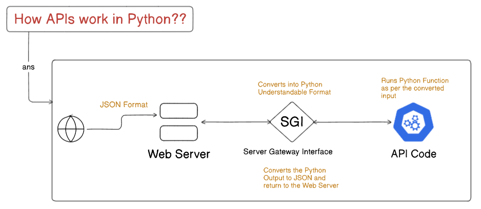
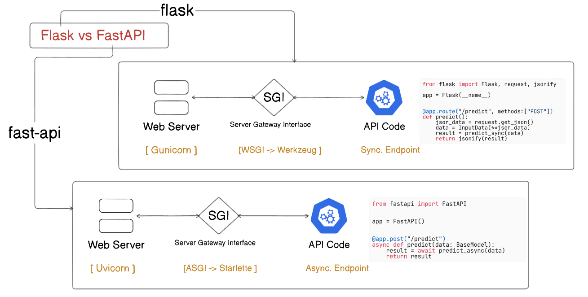
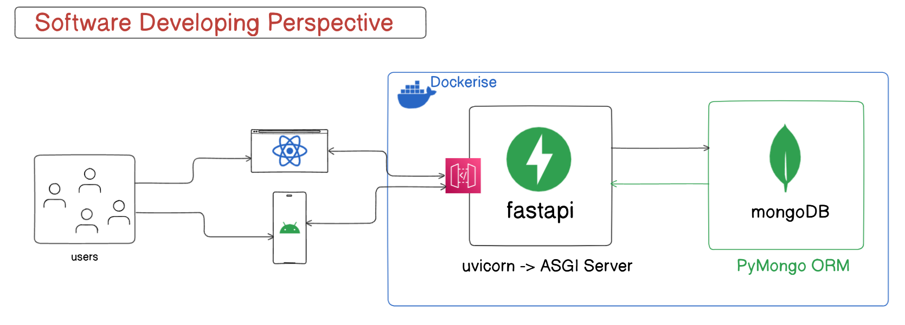
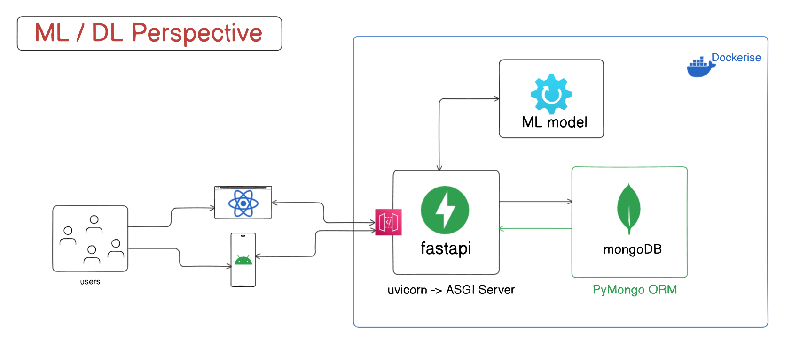

# Fast API Notes

Fast API is a **modern**, **high performance web framework** for building **`scalable and industry grade APIs with Python`** providing **low-latency in API response**. Its ofter compared with express of JS-Ecosystem for providing a good Developer Experience(DX).

It is named as Fast API because of 2 main reasons:

1. It is Fast to run (Providing Low Latency)
2. Its Fast to Write Code / Develop in it.

## Fast API is built on top of 2 libraries: 
- **Starlette**: Manages how your API recieves requests and sends back response
- **Pydatntic**: Used for data validation, to check if the data coming into our API is correct & in the right format. Often compared with zod with JS/TS Ecosystem.

----

## How APIs work in Python



----

## Flask vs FastAPI



----

## Software Developer Perspective



----

## Machine Learning / Deep Learning Perspective



----

### How to run this?

Install `uv` on your System and then execute the following commands:
   
```bash 
uv add -r .\requirements.txt
# or
uv sync
```